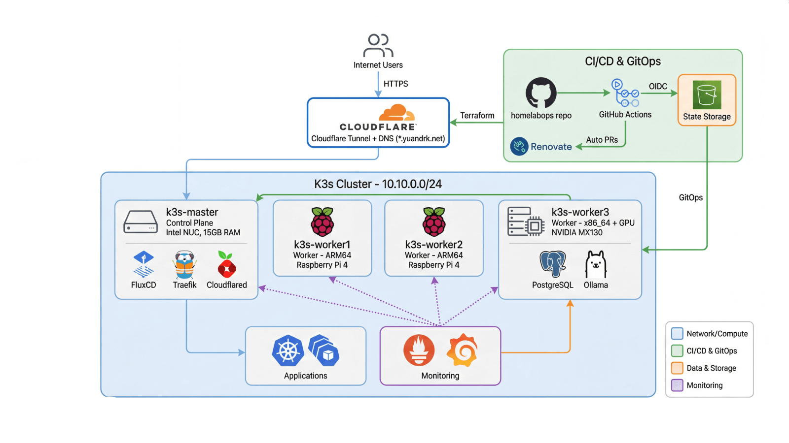

# HomeLab GitOps

[](https://k3s.io/) [](https://fluxcd.io/) [](https://terraform.io/) [](LICENSE) [](https://github.com/yuandrk/homelabops/actions/workflows/terraform-plan.yml) [](https://github.com/yuandrk/homelabops/actions/workflows/terraform-apply.yml)

Production-grade homelab infrastructure running K3s with GitOps automation, Infrastructure as Code, and full observability.

---

## 📑 Table of Contents

- [Overview](#-overview)
- [Tech Stack](#-tech-stack)
- [Architecture](#-architecture)
- [Quick Start](#-quick-start)
- [Services](#-services)
- [Current Status](#-current-status)
- [Repository Structure](#-repository-structure)
- [Documentation](#-documentation)
- [License](#-license)

---

## 📋 Overview

This repository contains Infrastructure as Code and documentation for a 4-node K3s cluster with GitOps automation. Infrastructure is managed via Ansible, Terraform for cloud resources, and FluxCD for continuous deployment.

## 🛠 Tech Stack

| Category | Technologies |
|----------|-------------|
| **Container Orchestration** |   |
| **GitOps & CD** |   |
| **Infrastructure as Code** |   |
| **Monitoring** |   |
| **Networking** |   |
| **Database** |  |
| **Security** |   |

## 🏗 Architecture



<details>
<summary><b>Infrastructure Details</b></summary>

| Component | Details |
|-----------|---------|
| **Cluster** | 4-node K3s (1 master + 3 workers) on Ubuntu 24.04 LTS |
| **GitOps** | FluxCD v2.6.0 with automatic reconciliation |
| **Networking** | Dual network (10.10.0.0/24 LAN + 192.168.1.0/24 Wi-Fi) |
| **External Access** | Cloudflare Tunnels + Traefik ingress |
| **DNS** | Pi-hole (host) + CoreDNS (cluster) |
| **Database** | PostgreSQL 15 on k3s-worker3 |
| **GPU** | NVIDIA GeForce MX130 (Ollama LLM workloads) |
| **Storage** | 76Gi total (local-path provisioner) |

</details>

## 🚀 Quick Start

**Prerequisites:** `kubectl`, `flux`, `terraform`, `ansible` | Ubuntu 24.04 nodes with SSH access

```bash
# Clone repository
git clone git@github.com:yuandrk/homelabops.git && cd homelabops

# Verify cluster health
kubectl get nodes                          # All nodes Ready
kubectl get kustomizations -n flux-system  # All reconciled
kubectl get helmreleases -A                # All deployed

# Check FluxCD status
flux get all -A
```

📖 **Detailed Guides:** [K3s Deployment](docs/k3s-deploy-summary.md) · [Ansible](docs/ansible-overview.md) · [Terraform](docs/terraform-guide.md) · [FluxCD](docs/fluxcd-setup.md)

## 🌐 Services

| Service | Description | URL |
|---------|-------------|-----|
| **Immich** | Photo management | `photos.yuandrk.net` |
| **Grafana** | Monitoring dashboards | `grafana.yuandrk.net` |
| **ActualBudget** | Financial management | `budget.yuandrk.net` |
| **Uptime Kuma** | Service monitoring | `uptime.yuandrk.net` |
| **n8n** | Workflow automation | `n8n.yuandrk.net` |
| **pgAdmin** | PostgreSQL admin | `pgadmin.yuandrk.net` |
| **Headlamp** | Kubernetes dashboard | `headlamp.yuandrk.net` |
| **Pi-hole** | DNS + ad-blocking | `pihole.yuandrk.net` |

## 📊 Current Status

### Cluster Health ✅

| Component | Status |
|-----------|--------|
| K3s Nodes | 4/4 Ready (v1.33.x) |
| Kustomizations | 7 reconciled |
| HelmReleases | 6 deployed |
| External Services | 8 via Cloudflare Tunnels |

### GitOps ✅
- **Sync**: Automatic reconciliation every 1 minute
- **Repository**: Connected via SSH deploy key
- **Webhook**: External trigger enabled

### Monitoring ✅
- **Prometheus**: 15-day retention, 10Gi storage
- **Grafana**: Flux, node, and cluster dashboards
- **Alerts**: 36 active PrometheusRules

### CI/CD ✅
- **Terraform Plan**: Auto-comment on PRs
- **Terraform Apply**: Auto-deploy with environment protection
- **GitHub OIDC**: Secure AWS authentication
- **Renovate**: Automated dependency updates

## 📁 Repository Structure

```
homelabops/
├── .github/workflows/    # CI/CD (Terraform plan/apply, Renovate)
├── ansible/              # Node configuration and K3s deployment
├── apps/                 # Application deployments (FluxCD)
├── clusters/             # FluxCD cluster configurations
├── docs/                 # Comprehensive documentation
├── infrastructure/       # Core infrastructure + monitoring
├── scripts/              # Automation utilities
├── terraform/            # Infrastructure as Code
│   └── live/homelab/     # AWS OIDC, Cloudflare tunnels
└── tools/                # Development tools
```

## 📚 Documentation

| Topic | Description |
|-------|-------------|
| [Architecture Diagrams](docs/architecture-diagrams.md) | Mermaid infrastructure diagrams |
| [Network Architecture](docs/network-architecture.md) | Network topology and setup |
| [K3s Deployment](docs/k3s-deploy-summary.md) | Cluster deployment guide |
| [FluxCD Setup](docs/fluxcd-setup.md) | GitOps setup and configuration |
| [FluxCD Troubleshooting](docs/fluxcd-troubleshooting.md) | Common issues and solutions |
| [Monitoring Setup](docs/monitoring-setup.md) | Prometheus/Grafana stack |
| [Terraform](docs/terraform-guide.md) | Cloud infrastructure management |
| [Ansible](docs/ansible-overview.md) | Infrastructure automation |
| [SOPS Secrets](docs/sops-secrets.md) | Secrets management with age encryption |
| [GPU Setup](docs/gpu-setup.md) | NVIDIA GPU configuration for K3s |

## 📝 License

This project is licensed under the MIT License - see the [LICENSE](LICENSE) file for details.

---

<p align="center">
  <i>Built with GitOps principles · Infrastructure as Code · Automated deployment</i>
</p>
