# Infrastructure Architecture Diagrams

This document contains Mermaid diagrams visualizing the homelab infrastructure architecture and workflows.

## Infrastructure Layers Overview

```mermaid
graph TB
    subgraph "External Layer"
        Internet[🌐 Internet]
        CloudFlare[☁️ Cloudflare]
        DNS[🏷️ DNS Records]
        Tunnel[🚇 Cloudflare Tunnel]
    end

    subgraph "Network Layer"
        Router[🏠 BT Router<br/>192.168.1.0/24]
        Switch[🔀 Gigabit Switch<br/>10.10.0.0/24]
        WiFi[📶 Wi-Fi Fallback]
    end

    subgraph "Infrastructure Layer"
        subgraph "AWS"
            S3[🪣 S3 Bucket<br/>terraform-state]
            DynamoDB[🗃️ DynamoDB<br/>State Locking]
        end
        
        subgraph "Management Tools"
            Terraform[🏗️ Terraform<br/>IaC Management]
            Ansible[⚙️ Ansible<br/>Config Management]
        end
    end

    subgraph "Compute Layer"
        subgraph "k3s-master (amd64)"
            Master[🖥️ k3s-master<br/>Ubuntu 24.04 LTS<br/>192.168.1.223]
            Traefik[🔀 Traefik<br/>LoadBalancer]
            PiHole[🛡️ Pi-hole<br/>Port 8081]
        end
        
        subgraph "k3s-worker1 (arm64)"
            Worker1[🍓 k3s-worker1<br/>Raspberry Pi<br/>192.168.1.137]
            PostgreSQL[🐘 PostgreSQL<br/>Docker]
        end
        
        subgraph "k3s-worker2 (arm64)"
            Worker2[🍓 k3s-worker2<br/>Raspberry Pi<br/>192.168.1.70]
        end
    end

    subgraph "Container Layer"
        subgraph "K3s Cluster"
            CoreDNS[🌐 CoreDNS<br/>10.42.0.3:53]
            FluxCD[🔄 FluxCD v2.6.0<br/>GitOps Controller]
            
            subgraph "Applications (apps namespace)"
                OpenWebUI[🤖 Open-WebUI<br/>chat.yuandrk.net<br/>50Gi Storage]
                Ollama[🧠 Ollama<br/>LLM Backend]
                Pipelines[🔗 Pipelines<br/>API Gateway]
            end
        end
    end

    subgraph "Data Layer"
        subgraph "Storage"
            LocalPath[💾 Local-Path<br/>Persistent Volumes]
            HostStorage[🗄️ Host Storage<br/>/var/lib/rancher/k3s]
        end
        
        subgraph "External Data"
            GitRepo[📚 GitHub Repository<br/>yuandrk/homelabops]
            HelmCharts[📦 Helm Charts<br/>open-webui/helm-charts]
        end
    end

    %% External connections
    Internet --> CloudFlare
    CloudFlare --> DNS
    CloudFlare --> Tunnel
    Tunnel --> Master

    %% Network connections
    Router --> Switch
    Router --> WiFi
    Switch --> Master
    Switch --> Worker1
    Switch --> Worker2

    %% Infrastructure management
    Terraform --> S3
    Terraform --> DynamoDB
    Terraform --> CloudFlare
    Ansible --> Master
    Ansible --> Worker1
    Ansible --> Worker2

    %% Container orchestration
    Master --> CoreDNS
    Master --> Traefik
    Master --> FluxCD
    FluxCD --> GitRepo
    FluxCD --> OpenWebUI
    FluxCD --> HelmCharts

    %% Storage connections
    OpenWebUI --> LocalPath
    LocalPath --> HostStorage
    PostgreSQL --> Worker1

    %% Application connections
    OpenWebUI --> Ollama
    OpenWebUI --> Pipelines

    %% Service exposure
    Traefik --> OpenWebUI
    PiHole --> Master

    classDef external fill:#e1f5fe
    classDef network fill:#f3e5f5
    classDef infra fill:#e8f5e8
    classDef compute fill:#fff3e0
    classDef container fill:#fce4ec
    classDef data fill:#f1f8e9

    class Internet,CloudFlare,DNS,Tunnel external
    class Router,Switch,WiFi network
    class S3,DynamoDB,Terraform,Ansible infra
    class Master,Worker1,Worker2,Traefik,PiHole,PostgreSQL compute
    class CoreDNS,FluxCD,OpenWebUI,Ollama,Pipelines container
    class LocalPath,HostStorage,GitRepo,HelmCharts data
```

## Network Flow Diagram

```mermaid
flowchart LR
    subgraph "External Access"
        User[👤 User]
        Domain[🌐 chat.yuandrk.net]
    end

    subgraph "Cloudflare"
        CF_DNS[📋 DNS Resolution]
        CF_Tunnel[🚇 Tunnel Service]
        CF_Proxy[🛡️ Proxy & Security]
    end

    subgraph "Homelab Network"
        subgraph "10.10.0.0/24 LAN"
            Master_LAN[🖥️ k3s-master<br/>10.10.0.1]
        end
        
        subgraph "192.168.1.0/24 Wi-Fi"
            Master_WiFi[🖥️ k3s-master<br/>192.168.1.223:80]
            Worker1_WiFi[🍓 k3s-worker1<br/>192.168.1.137]
            Worker2_WiFi[🍓 k3s-worker2<br/>192.168.1.70]
        end
    end

    subgraph "K3s Services"
        Traefik_LB[🔀 Traefik LoadBalancer<br/>Port 80/443]
        Ingress[📥 Ingress Controller<br/>Host: chat.yuandrk.net]
        OpenWebUI_Svc[🤖 open-webui Service<br/>ClusterIP: 10.43.171.88:80]
        OpenWebUI_Pod[📦 open-webui Pod<br/>10.42.0.19:8080]
    end

    %% External flow
    User --> Domain
    Domain --> CF_DNS
    CF_DNS --> CF_Proxy
    CF_Proxy --> CF_Tunnel
    CF_Tunnel --> Master_WiFi

    %% Internal K3s flow
    Master_WiFi --> Traefik_LB
    Traefik_LB --> Ingress
    Ingress --> OpenWebUI_Svc
    OpenWebUI_Svc --> OpenWebUI_Pod

    %% Node communication
    Master_LAN -.-> Worker1_WiFi
    Master_LAN -.-> Worker2_WiFi

    classDef external fill:#e3f2fd
    classDef cloudflare fill:#ff9800,color:#fff
    classDef network fill:#e8f5e8
    classDef k3s fill:#fce4ec

    class User,Domain external
    class CF_DNS,CF_Tunnel,CF_Proxy cloudflare
    class Master_LAN,Master_WiFi,Worker1_WiFi,Worker2_WiFi network
    class Traefik_LB,Ingress,OpenWebUI_Svc,OpenWebUI_Pod k3s
```

## GitOps Workflow

## FluxCD Reconciliation Flow

```mermaid
sequenceDiagram
    participant Dev as 👨‍💻 Developer
    participant GitHub as 📚 GitHub Repo
    participant FluxCD as 🔄 FluxCD Controller
    participant K8s as ☸️ Kubernetes API
    participant Apps as 🚀 Applications

    Dev->>GitHub: 1. Push changes to main
    Note over GitHub: Repository updated
    
    FluxCD->>GitHub: 2. Poll repository (1min interval)
    GitHub-->>FluxCD: 3. Return latest commit
    
    alt New changes detected
        FluxCD->>FluxCD: 4. Generate manifests
        FluxCD->>K8s: 5. Apply resources
        K8s-->>FluxCD: 6. Confirm deployment
        
        FluxCD->>Apps: 7. Update applications
        Apps-->>FluxCD: 8. Report status
        
        FluxCD->>GitHub: 9. Update status
    else No changes
        FluxCD->>FluxCD: 4. Skip reconciliation
    end
    
    Note over FluxCD,Apps: Continuous monitoring and drift detection
```

## Service Architecture

```mermaid
graph TB
    subgraph "External Services"
        Chat[🤖 chat.yuandrk.net]
        Pihole[🛡️ pihole.yuandrk.net]
        Budget[💰 budget.yuandrk.net]
        Webhook[🔗 flux-webhook.yuandrk.net]
    end

    subgraph "Cloudflare Tunnel"
        TunnelID[🚇 Tunnel ID:<br/>4a6abf9a-d178-4a56-9586-a3d77907c5f1]
    end

    subgraph "K3s Master (amd64)"
        subgraph "Host Services"
            PiholeHost[🛡️ Pi-hole FTL<br/>Port 8081]
        end
        
        subgraph "Traefik LoadBalancer"
            TraefikSvc[🔀 Port 80/443<br/>All node IPs]
        end
        
        subgraph "Applications (apps namespace)"
            OpenWebuiApp[🤖 open-webui<br/>ClusterIP: 10.43.171.88]
            OllamaApp[🧠 ollama<br/>ClusterIP: 10.43.189.162]
            PipelinesApp[🔗 pipelines<br/>ClusterIP: 10.43.44.222]
        end
    end

    subgraph "Storage"
        PV1[💾 PVC: open-webui<br/>50Gi local-path]
        PV2[💾 PVC: open-webui-pipelines<br/>2Gi local-path]
    end

    %% External to tunnel
    Chat --> TunnelID
    Pihole --> TunnelID
    Budget --> TunnelID
    Webhook --> TunnelID

    %% Tunnel to services
    TunnelID --> TraefikSvc
    TunnelID --> PiholeHost

    %% Traefik routing
    TraefikSvc --> OpenWebuiApp
    
    %% App connections
    OpenWebuiApp --> OllamaApp
    OpenWebuiApp --> PipelinesApp
    
    %% Storage
    OpenWebuiApp --> PV1
    PipelinesApp --> PV2

    classDef external fill:#e3f2fd
    classDef tunnel fill:#ff9800,color:#fff
    classDef host fill:#fff3e0
    classDef k8s fill:#fce4ec
    classDef storage fill:#f1f8e9

    class Chat,Pihole,Budget,Webhook external
    class TunnelID tunnel
    class PiholeHost,TraefikSvc host
    class OpenWebuiApp,OllamaApp,PipelinesApp k8s
    class PV1,PV2 storage
```

## Node Architecture & Affinity

```mermaid
graph TB
    subgraph "Architecture Distribution"
        subgraph "amd64 Node"
            MasterNode[🖥️ k3s-master<br/>Ubuntu 24.04 LTS<br/>Intel/AMD Architecture]
            
            subgraph "amd64 Workloads"
                OpenWebUIWorkload[🤖 open-webui<br/>nodeSelector: amd64<br/>50Gi Storage]
                OllamaWorkload[🧠 ollama<br/>LLM Processing]
                TraefikWorkload[🔀 Traefik<br/>Ingress Controller]
                FluxWorkload[🔄 FluxCD<br/>GitOps Controller]
            end
        end
        
        subgraph "arm64 Nodes"
            Worker1Node[🍓 k3s-worker1<br/>Raspberry Pi<br/>ARM64 Architecture]
            Worker2Node[🍓 k3s-worker2<br/>Raspberry Pi<br/>ARM64 Architecture]
            
            subgraph "arm64 Workloads"
                SystemPods[📦 System Pods<br/>CoreDNS, Metrics]
                LightWorkloads[⚡ Light Workloads<br/>Future apps]
            end
        end
    end

    subgraph "Scheduling Rules"
        NodeAffinity[📋 Node Affinity Rules<br/>kubernetes.io/arch: amd64<br/>Open-WebUI → k3s-master only]
    end

    %% Node assignments
    MasterNode --> OpenWebUIWorkload
    MasterNode --> OllamaWorkload
    MasterNode --> TraefikWorkload
    MasterNode --> FluxWorkload
    
    Worker1Node --> SystemPods
    Worker2Node --> SystemPods
    Worker1Node --> LightWorkloads
    Worker2Node --> LightWorkloads

    %% Affinity rules
    NodeAffinity --> OpenWebUIWorkload
    NodeAffinity -.-> LightWorkloads

    classDef amd64 fill:#e3f2fd
    classDef arm64 fill:#fff3e0
    classDef workload fill:#fce4ec
    classDef rule fill:#f1f8e9

    class MasterNode,OpenWebUIWorkload,OllamaWorkload,TraefikWorkload,FluxWorkload amd64
    class Worker1Node,Worker2Node,SystemPods,LightWorkloads arm64
    class NodeAffinity rule
```

