# 🔐 Authentik Authentication Server Deployment Plan

**Status**: 📋 Planning Phase  
**Target Environment**: K3s Homelab Cluster  
**Last Updated**: August 13, 2025  
**Estimated Deployment Time**: 2-3 hours

---

## 🎯 Deployment Overview

Authentik will be deployed as a centralized identity provider (IdP) for the homelab, providing Single Sign-On (SSO) and multi-factor authentication (MFA) for all services. The deployment follows GitOps best practices using FluxCD and integrates with the existing PostgreSQL database.

### Core Objectives
- **Centralized Authentication**: Single login for all homelab services
- **Enhanced Security**: MFA, session management, and audit logging
- **Service Integration**: OIDC/SAML integration with existing applications
- **Forward Authentication**: Protect services without native auth support
- **Self-Service**: User registration and password management

---

## 🏗️ Architecture Design

### Deployment Strategy

```mermaid
graph TB
    subgraph "External Access"
        Users[👥 Users]
        CF[☁️ Cloudflare]
        AuthTunnel[🚇 auth.yuandrk.net]
    end
    
    subgraph "K3s Cluster"
        subgraph "authentik namespace"
            AuthentikPod[🔐 Authentik Server<br/>k3s-worker2]
            Redis[📦 Redis Cache]
        end
        
        subgraph "Apps Integration"
            Grafana[📊 Grafana]
            Headlamp[🎛️ Headlamp]
            N8n[🔄 n8n]
            Chat[🤖 Open-WebUI]
            Budget[💰 ActualBudget]
        end
        
        Traefik[🔀 Traefik Ingress]
    end
    
    subgraph "External Services"
        PostgreSQL[🐘 PostgreSQL<br/>k3s-worker1:5432]
    end
    
    Users --> CF
    CF --> AuthTunnel
    AuthTunnel --> Traefik
    Traefik --> AuthentikPod
    AuthentikPod --> Redis
    AuthentikPod --> PostgreSQL
    
    AuthentikPod -.->|OIDC/Forward Auth| Grafana
    AuthentikPod -.->|OIDC/Forward Auth| Headlamp
    AuthentikPod -.->|OIDC/Forward Auth| N8n
    AuthentikPod -.->|OIDC/Forward Auth| Chat
    AuthentikPod -.->|Forward Auth| Budget
```


### Infrastructure Components

| Component | Location | Purpose | Configuration |
|-----------|----------|---------|---------------|
| **Authentik Server** | k3s-worker2 | Core IdP service | Helm chart deployment |
| **Redis Cache** | k3s-worker2 | Session storage | Bundled with Helm |
| **PostgreSQL** | k3s-worker1 | User/config data | External existing DB |
| **Ingress** | Traefik | External access | `auth.yuandrk.net` |
| **Secrets** | SOPS | Encrypted credentials | FluxCD managed |

---

## 📋 Resource Requirements

### System Resources
```yaml
authentik:
  resources:
    requests:
      cpu: 200m
      memory: 512Mi
    limits:
      cpu: 1000m
      memory: 2Gi
  
redis:
  resources:
    requests:
      cpu: 100m
      memory: 128Mi
    limits:
      cpu: 500m
      memory: 256Mi
```

### Storage Requirements
- **Authentik Data**: 1Gi PVC (configuration, media files)
- **Redis**: Ephemeral (no persistence needed)
- **Database**: ~100MB in existing PostgreSQL

### Network Requirements
- **Internal**: 10.43.x.x (K8s service network)
- **Database**: Access to 10.10.0.2:5432
- **External**: auth.yuandrk.net via Cloudflare tunnel

---

## 🗄️ Database Integration Plan

### PostgreSQL Setup
The existing PostgreSQL instance on k3s-worker1 will be extended with an Authentik database:

```sql
-- Database creation (to be executed manually)
CREATE DATABASE authentik;
CREATE USER authentik_user WITH PASSWORD 'secure_password';
GRANT ALL PRIVILEGES ON DATABASE authentik TO authentik_user;

-- Required extensions
\c authentik;
CREATE EXTENSION IF NOT EXISTS "uuid-ossp";
CREATE EXTENSION IF NOT EXISTS "citext";
```

### Connection Configuration
- **Host**: `10.10.0.2` (k3s-worker1)
- **Port**: `5432`
- **Database**: `authentik`
- **User**: `authentik_user`
- **SSL Mode**: `require` (for security)

---

## 🔐 Security Configuration

### Secrets Management
All sensitive configuration will be encrypted using SOPS:

```yaml
# clusters/prod/secrets/authentik-secrets.yaml
apiVersion: v1
kind: Secret
metadata:
  name: authentik-credentials
  namespace: authentik
type: Opaque
data:
  secret_key: <base64-encoded-50-char-key>
  postgres_password: <base64-encoded-db-password>
  akadmin_password: <base64-encoded-admin-password>
```

### Authentication Features
- **Multi-Factor Authentication**: TOTP, WebAuthn support
- **Password Policies**: Complexity requirements, expiration
- **Session Management**: Configurable timeouts, concurrent sessions
- **Audit Logging**: All authentication events tracked
- **Failed Login Protection**: Rate limiting, account lockout

### Network Security
- **Namespace Isolation**: Dedicated `authentik` namespace
- **Network Policies**: Restrict pod-to-pod communication
- **TLS Termination**: At Traefik ingress level
- **Internal Communication**: Service-to-service encryption

---

## 🔧 Application Integration Strategy

### Priority 1: Forward Authentication
Services without native OIDC support will use Traefik ForwardAuth middleware:

| Service | Current Auth | Integration Type | Complexity |
|---------|-------------|------------------|------------|
| ActualBudget | None/Basic | Forward Auth | Low |
| Uptime Kuma | Local users | Forward Auth | Low |
| pgAdmin | Local users | Forward Auth | Medium |

### Priority 2: Native OIDC Integration
Services with native OIDC support will be configured for direct integration:

| Service | Current Auth | Integration Type | Complexity |
|---------|-------------|------------------|------------|
| Grafana | admin/flux | OIDC | Medium |
| n8n | Local users | OIDC | Medium |
| Open-WebUI | Local users | OIDC | High |

### Priority 3: Advanced Integration
Services requiring custom configuration:

| Service | Current Auth | Integration Type | Complexity |
|---------|-------------|------------------|------------|
| Headlamp | Token-based | Custom OIDC | High |
| Future Apps | Various | Per-app basis | Variable |

---

## 📁 FluxCD Structure

Following the established GitOps pattern:

```
apps/
└── authentik/
    └── base/
        ├── kustomization.yaml
        ├── namespace.yaml
        ├── helm-repository.yaml
        ├── helm-release.yaml
        └── ingress.yaml

clusters/prod/secrets/
├── authentik-secrets.enc.yaml
└── kustomization.yaml

clusters/prod/
├── apps.yaml (updated to include authentik)
└── authentik.yaml (new Kustomization)
```

### Helm Chart Configuration
```yaml
# Key values.yaml sections
authentik:
  secret_key: "${SECRET_KEY}"
  postgresql:
    host: "10.10.0.2"
    name: "authentik"
    user: "authentik_user"
    password: "${POSTGRES_PASSWORD}"
  
redis:
  enabled: true
  architecture: standalone
  
ingress:
  enabled: true
  ingressClassName: traefik
  hostname: auth.yuandrk.net
  
server:
  nodeSelector:
    kubernetes.io/arch: arm64
```

---

## 🚀 Implementation Timeline

### Phase 1: Infrastructure Setup (30 mins)
1. ✅ **Research & Planning** - Architecture design and requirements
2. ⏳ **Database Preparation** - Create Authentik database and user
3. ⏳ **Secrets Creation** - Generate and encrypt credentials with SOPS
4. ⏳ **Base Manifests** - Create Helm chart and Kubernetes resources

### Phase 2: Core Deployment (45 mins)
5. ⏳ **FluxCD Integration** - Deploy Authentik via GitOps
6. ⏳ **Initial Configuration** - Set up admin user and basic policies
7. ⏳ **Ingress Setup** - Configure Traefik routing and Cloudflare tunnel
8. ⏳ **Health Verification** - Ensure all components are running

### Phase 3: Service Integration (60 mins)
9. ⏳ **Forward Auth Setup** - Configure Traefik middleware
10. ⏳ **Priority 1 Services** - ActualBudget, Uptime Kuma forward auth
11. ⏳ **OIDC Integration** - Grafana native OIDC configuration
12. ⏳ **Testing & Validation** - End-to-end authentication flow testing

### Phase 4: Documentation & Monitoring (15 mins)
13. ⏳ **Monitoring Setup** - Add Authentik metrics to Prometheus
14. ⏳ **Documentation** - Update service access documentation
15. ⏳ **Backup Strategy** - Document database backup procedures

---

## 🎛️ Configuration Management

### Initial Admin Setup
- **URL**: `https://auth.yuandrk.net/if/flow/initial-setup/`
- **Username**: `akadmin`
- **Password**: Generated and stored in SOPS secrets

### Core Configuration Objects
- **Applications**: One per integrated service
- **Providers**: OIDC/SAML providers for each application  
- **Property Mappings**: User attribute mappings
- **Policies**: Authentication and authorization rules
- **Flows**: Login, logout, registration workflows

### User Management
- **Default Groups**: `homelab-users`, `homelab-admins`
- **Registration**: Initially admin-only, expand as needed
- **Profile Fields**: Email, name, timezone
- **MFA Requirements**: Enforced for admin accounts

---

## 🔍 Monitoring & Maintenance

### Health Checks
- **Liveness Probe**: `/auth/health/live/` endpoint
- **Readiness Probe**: `/auth/health/ready/` endpoint  
- **Startup Probe**: 60-second timeout for initialization

### Metrics Integration
```yaml
# Prometheus ServiceMonitor
spec:
  selector:
    matchLabels:
      app.kubernetes.io/name: authentik
  endpoints:
  - port: http-metrics
    path: /metrics
```

### Log Aggregation
- **Location**: Standard Kubernetes logs
- **Retention**: 7 days (default cluster policy)
- **Key Events**: Authentication attempts, policy violations, errors

### Backup Strategy
- **Database**: Included in PostgreSQL backup strategy
- **Configuration**: Version controlled via GitOps
- **Secrets**: SOPS-encrypted in git repository

---

## ⚠️ Risk Assessment

### High Risk
- **Database Dependency**: Authentik failure affects all services
- **Single Point of Auth**: No redundancy in authentication layer
- **Configuration Complexity**: Potential for misconfiguration

### Mitigation Strategies  
- **Emergency Access**: Maintain local admin accounts on critical services
- **Database Monitoring**: Alert on PostgreSQL connectivity issues
- **Configuration Backup**: Export Authentik config regularly
- **Rollback Plan**: Prepared FluxCD rollback strategy

### Testing Requirements
- **Authentication Flow**: End-to-end login/logout testing
- **Service Integration**: Each integrated service functionality
- **Failure Scenarios**: Database unavailability, network partitions
- **Performance**: Login latency and concurrent user limits

---

## 📚 References & Documentation

### Official Documentation
- [Authentik Kubernetes Installation](https://docs.goauthentik.io/docs/install-config/install/kubernetes)
- [Helm Chart Configuration](https://artifacthub.io/packages/helm/goauthentik/authentik)
- [Traefik ForwardAuth Integration](https://docs.goauthentik.io/docs/providers/proxy/forward_auth)

### Homelab Integration Guides
- [FluxCD SOPS Secrets Management](./docs/DevOps-Workflow/SOPS-Secrets-Management.md)
- [PostgreSQL Database Access](./docs/Database/PostgreSQL-Database-k3s-worker1.md)
- [Monitoring Stack Configuration](./docs/Monitoring/Monitoring-Stack-Overview.md)

### Post-Deployment Tasks
- [ ] Update service documentation with OIDC configuration
- [ ] Create user onboarding guide
- [ ] Document emergency access procedures  
- [ ] Set up automated configuration backups
- [ ] Configure alerting for authentication failures

---

**Next Steps**: Review this plan, approve the architecture, and proceed with Phase 1 implementation. The deployment will be performed incrementally with validation at each phase to ensure system stability.