# SOPS Secrets Management for K3s Homelab

**Date**: August 2025  
**Status**: ✅ Active and Working  
**Components**: SOPS, age encryption, FluxCD integration

## Overview

This document describes the SOPS (Secrets OPerationS) implementation for secure secrets management in the K3s homelab GitOps workflow. Using age encryption, secrets can be safely stored in Git and automatically decrypted by FluxCD.

## Architecture

```mermaid
graph TB
    subgraph "Local Development"
        Dev[👨‍💻 Developer]
        SOPS[🔐 SOPS CLI]
        AgeKey[🔑 age.key]
    end
    
    subgraph "Git Repository"
        Git[📁 GitHub Repo]
        EncSecrets[🔒 *.enc.yaml files]
        SOPSConfig[⚙️ .sops.yaml]
    end
    
    subgraph "K3s Cluster"
        FluxCD[🚀 FluxCD]
        SOPSSecret[🔐 sops-age Secret]
        K8sSecrets[📦 Kubernetes Secrets]
    end
    
    Dev --> SOPS
    SOPS --> AgeKey
    SOPS --> EncSecrets
    EncSecrets --> Git
    SOPSConfig --> Git
    FluxCD --> Git
    SOPSSecret --> FluxCD
    FluxCD --> K8sSecrets
```



## Prerequisites

### 1. Install SOPS and age
```bash
# macOS
brew install sops age

# Linux
curl -LO https://github.com/getsops/sops/releases/download/v3.10.2/sops-v3.10.2.linux.amd64
sudo mv sops-v3.10.2.linux.amd64 /usr/local/bin/sops
sudo chmod +x /usr/local/bin/sops

curl -LO https://github.com/FiloSottile/age/releases/download/v1.2.1/age-v1.2.1-linux-amd64.tar.gz
tar -xf age-v1.2.1-linux-amd64.tar.gz
sudo mv age/age* /usr/local/bin/
```

## Setup Process

### 1. Generate age Keys
```bash
# Generate age encryption key pair
age-keygen -o age.key

# Output shows public key (save this!)
# Public key: age1hruxjkg7m9sgjwlf6xvz74cy8l8g8ye0p800uja87w6fhz5qs5yqa2y6xc
```

⚠️ **IMPORTANT**: Store `age.key` securely and never commit to Git!

### 2. Configure SOPS
Create `.sops.yaml` in repository root:

```yaml
creation_rules:
  # Encrypt secrets in all environments with .enc.yaml extension
  - path_regex: .*\.enc\.yaml$
    encrypted_regex: ^(data|stringData)$
    age: age1hruxjkg7m9sgjwlf6xvz74cy8l8g8ye0p800uja87w6fhz5qs5yqa2y6xc
  
  # Specific rule for production secrets
  - path_regex: clusters/prod/.*\.enc\.yaml$
    encrypted_regex: ^(data|stringData)$
    age: age1hruxjkg7m9sgjwlf6xvz74cy8l8g8ye0p800uja87w6fhz5qs5yqa2y6xc
```

### 3. Create FluxCD Secret
```bash
# Create secret in flux-system namespace
kubectl create secret generic sops-age \
  --namespace=flux-system \
  --from-file=age.agekey=age.key
```

### 4. Configure FluxCD Kustomizations
Add decryption support to Kustomizations:

```yaml
apiVersion: kustomize.toolkit.fluxcd.io/v1
kind: Kustomization
metadata:
  name: monitoring-secrets
  namespace: flux-system
spec:
  # ... other config
  decryption:
    provider: sops
    secretRef:
      name: sops-age
```

## Working with Secrets

### Creating Encrypted Secrets

1. **Create plain YAML file**:
```yaml
# grafana-admin.enc.yaml
apiVersion: v1
kind: Secret
metadata:
  name: grafana-admin-credentials
  namespace: monitoring
type: Opaque
stringData:
  admin-user: admin
  admin-password: homelab-super-secret-password-2025
```

2. **Encrypt with SOPS**:
```bash
sops -e -i grafana-admin.enc.yaml
```

3. **Result** (safe to commit):
```yaml
apiVersion: v1
kind: Secret
metadata:
    name: grafana-admin-credentials
    namespace: monitoring
type: Opaque
stringData:
    admin-user: ENC[AES256_GCM,data:XSL83AY=,iv:...,tag:...,type:str]
    admin-password: ENC[AES256_GCM,data:t9KqGQ9W3/9u...,iv:...,tag:...,type:str]
sops:
    age:
        - recipient: age1hruxjkg7m9sgjwlf6xvz74cy8l8g8ye0p800uja87w6fhz5qs5yqa2y6xc
          enc: |
            -----BEGIN AGE ENCRYPTED FILE-----
            ...
            -----END AGE ENCRYPTED FILE-----
    lastmodified: "2025-08-08T17:55:04Z"
    mac: ENC[AES256_GCM,data:...,type:str]
    encrypted_regex: ^(data|stringData)$
    version: 3.10.2
```

### Editing Encrypted Secrets

```bash
# Edit encrypted file (SOPS auto-decrypts in editor)
sops grafana-admin.enc.yaml

# Or with specific editor
export EDITOR=vim
sops grafana-admin.enc.yaml
```

### Viewing Decrypted Content

```bash
# View decrypted content (don't save!)
sops -d grafana-admin.enc.yaml

# Decrypt to temporary file
sops -d grafana-admin.enc.yaml > temp-decrypted.yaml
# Remember to delete temp file!
```

## Directory Structure

```
homelabops/
├── .sops.yaml                           # SOPS configuration
├── age.key                             # Private key (NOT in Git)
├── clusters/prod/
│   └── monitoring/
│       ├── secrets/
│       │   ├── kustomization.yaml      # Secrets kustomization
│       │   └── grafana-admin.enc.yaml  # Encrypted secret
│       └── kustomization.yaml          # Include secrets
└── clusters/prod/production/
    ├── kustomization.yaml               # Include monitoring-secrets
    └── monitoring-secrets.yaml         # FluxCD Kustomization with SOPS
```

## Common Operations

### 1. Create New Secret from kubectl
```bash
# Generate secret YAML
kubectl create secret generic my-secret \
  --from-literal=username=admin \
  --from-literal=password=secretpass \
  --dry-run=client -o yaml > my-secret.enc.yaml

# Encrypt it
sops -e -i my-secret.enc.yaml

# Add to kustomization
echo "- my-secret.enc.yaml" >> kustomization.yaml
```

### 2. PostgreSQL Connection Secret
```bash
# Create PostgreSQL credentials
cat << EOF > postgres-credentials.enc.yaml
apiVersion: v1
kind: Secret
metadata:
  name: postgres-credentials
  namespace: monitoring
type: Opaque
stringData:
  username: yuandrk
  password: your-postgres-password-here
  database: homelab
  host: 10.10.0.2
  port: "5432"
EOF

# Encrypt
sops -e -i postgres-credentials.enc.yaml
```

### 3. Update Existing Secret
```bash
# Edit encrypted secret
sops postgres-credentials.enc.yaml

# Commit changes
git add postgres-credentials.enc.yaml
git commit -m "feat: update postgres credentials"
git push
```

## Security Best Practices

### ✅ DO:
- Store `age.key` in password manager or secure vault
- Use `.enc.yaml` suffix for encrypted files
- Encrypt before committing to Git
- Regular backup of age keys
- Use different keys for different environments
- Review encrypted diffs before pushing

### ❌ DON'T:
- Commit `age.key` or any private keys
- Store decrypted secrets in repository
- Share age keys via insecure channels
- Use same key for all environments
- Leave decrypted files on disk

## Troubleshooting

### Common Issues

#### 1. **SOPS can't decrypt**
```bash
# Error: failed to retrieve data key
# Solution: Ensure age.key is in current directory or SOPS_AGE_KEY_FILE is set
export SOPS_AGE_KEY_FILE=path/to/age.key
```

#### 2. **FluxCD can't decrypt**
```bash
# Check if sops-age secret exists
kubectl get secret sops-age -n flux-system

# Recreate if missing
kubectl create secret generic sops-age \
  --namespace=flux-system \
  --from-file=age.agekey=age.key
```

#### 3. **Wrong age recipient**
```bash
# Error: no age recipients provided
# Solution: Update .sops.yaml with correct public key
age-keygen -y age.key  # Show public key from private key
```

### Validation Commands

```bash
# Test SOPS installation
sops --version

# Test age installation
age --version

# Verify secret can be decrypted
sops -d your-secret.enc.yaml

# Check FluxCD Kustomization status
kubectl describe kustomization monitoring-secrets -n flux-system

# Verify Kubernetes secret was created
kubectl get secret grafana-admin-credentials -n monitoring -o yaml
```

## Backup Strategy

### 1. Private Key Backup
```bash
# Encrypt age key with password
age -p age.key > age.key.encrypted

# Store in secure location:
# - 1Password
# - HashiCorp Vault
# - AWS Secrets Manager
# - Encrypted USB drive
```

### 2. Recovery Process
```bash
# Decrypt backup key
age -d age.key.encrypted > age.key

# Recreate FluxCD secret
kubectl delete secret sops-age -n flux-system
kubectl create secret generic sops-age \
  --namespace=flux-system \
  --from-file=age.agekey=age.key
```

## Integration Examples

### Use Secret in HelmRelease
```yaml
apiVersion: helm.toolkit.fluxcd.io/v2
kind: HelmRelease
metadata:
  name: kube-prometheus-stack
  namespace: monitoring
spec:
  values:
    grafana:
      admin:
        existingSecret: grafana-admin-credentials
        userKey: admin-user
        passwordKey: admin-password
```

### Use Secret in Deployment
```yaml
apiVersion: apps/v1
kind: Deployment
metadata:
  name: my-app
spec:
  template:
    spec:
      containers:
      - name: app
        env:
        - name: POSTGRES_PASSWORD
          valueFrom:
            secretKeyRef:
              name: postgres-credentials
              key: password
```

## Git Workflow

```bash
# Standard workflow with encrypted secrets
git add *.enc.yaml
git add .sops.yaml
git commit -m "feat: add encrypted database credentials"
git push

# FluxCD automatically:
# 1. Detects changes in Git
# 2. Decrypts secrets using sops-age
# 3. Applies to Kubernetes cluster
```

---

**🔐 Security Status**: All secrets encrypted with age1hruxjkg7m9sgjwlf6xvz74cy8l8g8ye0p800uja87w6fhz5qs5yqa2y6xc  
**🔄 Last Updated**: August 2025 | **✅ Status**: Fully Operational