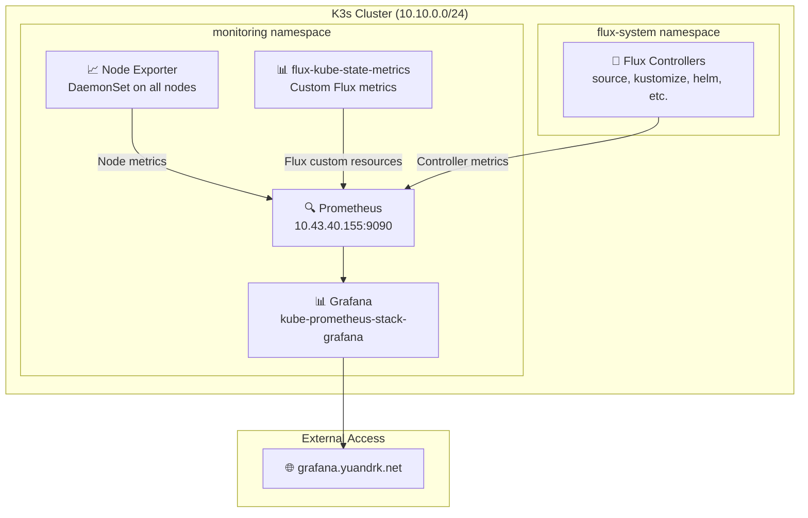

# Enhanced Monitoring Setup - K3s Homelab

**Date**: August 2025  
**Status**: ✅ Active and Working  
**Components**: Prometheus, Grafana, Node Exporter, Flux Monitoring

## Overview

This document describes the enhanced monitoring setup implemented for the K3s homelab, including comprehensive node monitoring, Flux GitOps monitoring, and custom alerting rules.

## Architecture



## Monitoring Components

### 1. **Prometheus Stack**
- **Main Prometheus**: `prometheus-kube-prometheus-stack-prometheus-0`
- **Grafana**: `kube-prometheus-stack-grafana` 
- **Node Exporters**: DaemonSet on all 3 nodes
- **Storage**: 10Gi PVC, 15 days retention

### 2. **Custom Flux Monitoring**
- **flux-kube-state-metrics**: Custom deployment for Flux CRD metrics
- **ServiceMonitor**: Scrapes flux-kube-state-metrics on port 8080
- **PodMonitor**: Scrapes Flux controllers on port 8080 (http-prom)

### 3. **Custom Dashboards**
- **Node Exporter - K3s Homelab**: CPU, Memory, Disk, Inode usage per node
- **Flux Control Plane**: Pre-configured Flux controller monitoring
- **Flux Cluster Stats**: Flux resource status and reconciliation

## Alert Rules Overview

### Node Monitoring Alerts (8 rules)
| Alert Name | Condition | Duration | Severity |
|------------|-----------|----------|----------|
| `NodeHighMemoryUtilization` | Memory >90% | 5min | warning |
| `NodeHighCPUUtilization` | CPU >80% | 10min | warning |
| `NodeHighDiskUtilization` | Disk >85% | 5min | warning |
| `NodeHighInodeUtilization` | Inodes >90% | 5min | warning |
| `NodeNotReady` | Node NotReady | 5min | **critical** |
| `NodeDiskPressure` | Disk pressure condition | 2min | warning |
| `NodeMemoryPressure` | Memory pressure condition | 2min | warning |
| `NodeDown` | Node exporter down | 1min | **critical** |

### Pod/Kubernetes Monitoring (8 rules)
| Alert Name | Condition | Duration | Severity |
|------------|-----------|----------|----------|
| `PodsPending` | Pods in Pending state | 10min | warning |
| `PodCrashLooping` | Pod restart rate >0 | 5min | warning |
| `PodHighCPUUsage` | Pod CPU >80% | 10min | warning |
| `PodHighMemoryUsage` | Pod memory >90% limit | 5min | warning |
| `NamespaceHighCPUUsage` | Namespace CPU >200% | 15min | warning |
| `NamespaceHighMemoryUsage` | Namespace memory >4GB | 10min | warning |
| `PodNearCPULimit` | Pod near CPU limit >80% | 5min | info |
| `PodNearMemoryLimit` | Pod near memory limit >80% | 5min | info |

### Flux GitOps Monitoring (2 rules)
| Alert Name | Condition | Duration | Severity |
|------------|-----------|----------|----------|
| `FluxReconciliationFailure` | Flux reconciliation failing | 5min | warning |
| `FluxSuspendedResource` | Flux resource suspended | 1min | info |

## File Structure

```
clusters/prod/monitoring/
├── kustomization.yaml              # Main monitoring kustomization
├── controllers/
│   └── kube-prometheus-stack/      # Helm release for prometheus stack
└── configs/
    ├── kustomization.yaml          # Configs kustomization  
    ├── flux-kube-state-metrics.yaml # Flux metrics deployment + ServiceMonitor
    ├── podmonitor.yaml             # PodMonitor for flux-system controllers
    ├── node-exporter-dashboard.yaml # Custom node dashboard ConfigMap
    ├── prometheus-rules.yaml       # Custom PrometheusRules (17 alerts)
    └── dashboards/
        ├── kustomization.yaml      # Dashboard configs
        ├── cluster.json           # Flux cluster dashboard
        └── control-plane.json     # Flux control-plane dashboard
```

## Key Configuration Details

### ServiceMonitor Label Requirements
```yaml
# flux-kube-state-metrics ServiceMonitor must have:
labels:
  app.kubernetes.io/name: flux-kube-state-metrics
  app.kubernetes.io/component: monitoring
  release: kube-prometheus-stack  # ⚠️ Required for Prometheus selector
```

### PodMonitor Label Requirements  
```yaml
# flux-system PodMonitor must have:
labels:
  app.kubernetes.io/part-of: flux
  app.kubernetes.io/component: monitoring  # ✅ Matches Prometheus podMonitorSelector
```

### Prometheus Selectors
```yaml
# Prometheus configured with these selectors:
podMonitorSelector:
  matchLabels:
    app.kubernetes.io/component: monitoring

serviceMonitorSelector:
  matchLabels:
    release: kube-prometheus-stack
```

## Access Points

### Grafana Dashboard
- **External**: https://grafana.yuandrk.net  
- **Credentials**: admin / flux
- **Dashboards**:
  - "Node Exporter - K3s Homelab" (custom)
  - "Flux Control Plane" 
  - "Flux Cluster Stats"

### Prometheus
- **Internal**: http://10.43.40.155:9090
- **Port-forward**: `kubectl port-forward -n monitoring svc/kube-prometheus-stack-prometheus 9090:9090`

## Useful Queries

### Node Monitoring
```promql
# Memory utilization per node
(1 - (node_memory_MemAvailable_bytes / node_memory_MemTotal_bytes)) * 100

# CPU utilization per node  
100 - (avg by(instance) (irate(node_cpu_seconds_total{mode="idle"}[5m])) * 100)

# Disk utilization per node
100 - ((node_filesystem_avail_bytes{mountpoint="/"} / node_filesystem_size_bytes{mountpoint="/"}) * 100)
```

### Flux Monitoring
```promql
# Flux reconciliation success rate
gotk_reconcile_condition{type="Ready",status="True"}

# Flux resource status
gotk_resource_info

# Flux reconciliation duration
gotk_reconcile_duration_seconds_count
```

## Troubleshooting

### Common Issues

#### 1. **Metrics not appearing in Prometheus**
```bash
# Check ServiceMonitor labels
kubectl get servicemonitor -n monitoring flux-kube-state-metrics -o yaml | grep labels -A 10

# Verify Prometheus selectors
kubectl get prometheus -n monitoring -o yaml | grep -A 5 "serviceMonitorSelector\|podMonitorSelector"
```

#### 2. **Flux metrics missing**
```bash
# Check flux-kube-state-metrics deployment
kubectl get pods -n monitoring | grep flux-kube-state-metrics
kubectl logs -n monitoring -l app.kubernetes.io/name=flux-kube-state-metrics

# Verify Flux controllers have http-prom port
kubectl get pods -n flux-system -o yaml | grep -A 5 -B 5 "http-prom"
```

#### 3. **Alerts not firing**
```bash
# Check PrometheusRule deployment
kubectl get prometheusrules -n monitoring homelab-monitoring-rules

# Verify alert rule syntax
kubectl get prometheusrules -n monitoring homelab-monitoring-rules -o yaml
```

### Diagnostic Commands

```bash
# Check all monitoring components
kubectl get all -n monitoring

# Check monitoring kustomizations
kubectl get kustomizations -n flux-system | grep monitoring

# Check Flux targets in Prometheus (requires port-forward)
curl -s "http://localhost:9090/api/v1/targets" | jq '.data.activeTargets[] | select(.labels.job | contains("flux"))'

# Test specific metrics
curl -s "http://localhost:9090/api/v1/query?query=gotk_reconcile_duration_seconds_count" | jq '.data.result | length'
```

## Maintenance

### Regular Checks
- **Weekly**: Review alert status in Grafana
- **Monthly**: Check disk usage trends and adjust retention if needed
- **Quarterly**: Review alert thresholds based on actual usage patterns

### Updating Thresholds
Alert thresholds can be adjusted in `clusters/prod/monitoring/configs/prometheus-rules.yaml`:

```yaml
# Example: Change memory alert threshold from 90% to 85%
- alert: NodeHighMemoryUtilization
  expr: (1 - (node_memory_MemAvailable_bytes / node_memory_MemTotal_bytes)) * 100 > 85  # Changed from 90
```

### Adding New Alerts
1. Edit `clusters/prod/monitoring/configs/prometheus-rules.yaml`
2. Add new rule to appropriate group (`node.rules`, `kubernetes.rules`, `flux.rules`)
3. Commit and push - FluxCD will deploy automatically
4. Verify in Grafana → Alerting → Alert Rules

## Implementation Timeline

- **August 6, 2025**: Initial custom monitoring rules deployment
- **August 7, 2025**: ServiceMonitor label fix for Prometheus selector compatibility
- **Status**: ✅ Fully operational with comprehensive coverage

## Related Documentation

- [Monitoring Stack Overview](Monitoring-Stack-Overview.md)  
- [FluxCD Health Monitoring](FluxCD-Health-Monitoring.md)
- [Monitoring Troubleshooting](Monitoring-Troubleshooting.md)