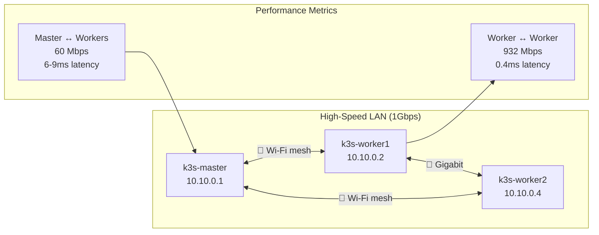
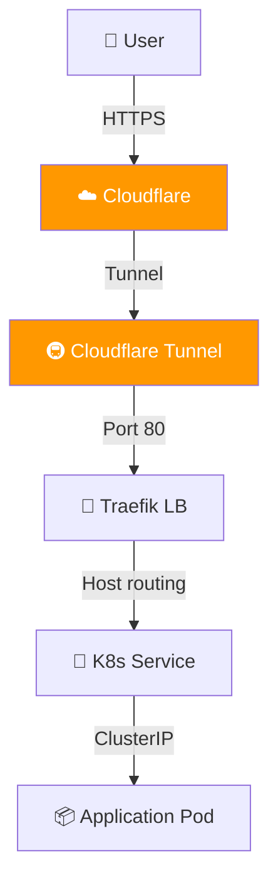
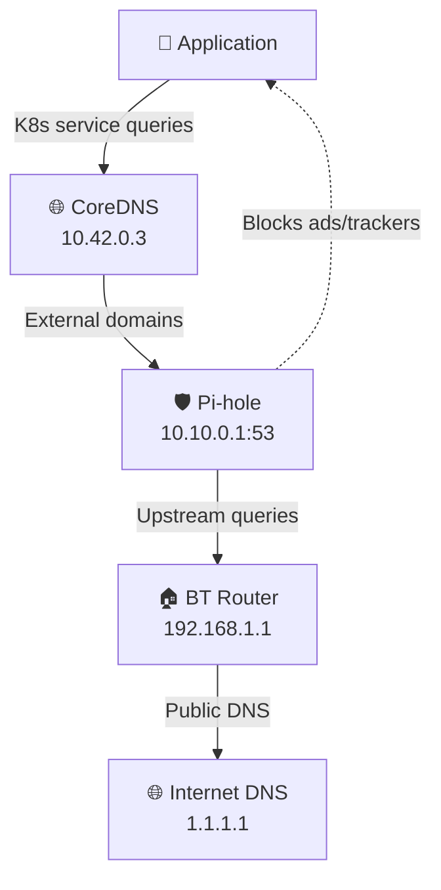

# 🌐 Complete Homelab Network Architecture & CIDR Layout

**Status**: ✅ Active K3s cluster with dual networking strategy  
**Last Updated**: August 12, 2025  
**Cluster**: 3-node K3s cluster (1 master + 2 workers)

---

## 📋 CIDR Summary Table

| Network Layer | CIDR Block | Purpose | Gateway | DNS | Notes |
|---------------|------------|---------|---------|-----|-------|
| **Host LAN** | `10.10.0.0/24` | Internal cluster communication | None | 10.10.0.1 | Gigabit wired, unmanaged switch |
| **Host Wi-Fi** | `192.168.1.0/24` | Internet access fallback | 192.168.1.1 | 192.168.1.1 | BT Router DHCP |
| **K3s Pods** | `10.42.0.0/16` | Container networking | N/A | 10.42.0.3 | Flannel CNI (VXLAN) |
| **K3s Services** | `10.43.0.0/16` | Service discovery | N/A | 10.42.0.3 | ClusterIP services |
| **K3s Node Pods** | `10.42.0.0/24` | Master node pods | N/A | 10.42.0.3 | k3s-master pod subnet |
| **K3s Node Pods** | `10.42.1.0/24` | Worker2 node pods | N/A | 10.42.0.3 | k3s-worker2 pod subnet |
| **K3s Node Pods** | `10.42.2.0/24` | Worker1 node pods | N/A | 10.42.0.3 | k3s-worker1 pod subnet |

---

## 🏗️ Complete Network Topology Diagram

```mermaid
graph TB
    subgraph "Internet & External"
        Internet[🌐 Internet]
        CF[☁️ Cloudflare<br/>DNS & Tunnels]
        Users[👥 External Users]
    end
    
    subgraph "BT Router (ISP Gateway)"
        Router[🏠 BT Router<br/>192.168.1.1/24<br/>DHCP: 192.168.1.100-200]
        WiFiNetwork[📶 Wi-Fi Network<br/>192.168.1.0/24]
    end
    
    subgraph "Homelab Physical Network"
        subgraph "Wi-Fi Connections (Internet Access)"
            MasterWiFi[🖥️ k3s-master<br/>wlp2s0: 192.168.1.223]
            Worker1WiFi[🍓 k3s-worker1<br/>wlan0: 192.168.1.137]
            Worker2WiFi[🍓 k3s-worker2<br/>wlan0: 192.168.1.70]
            MacBookWiFi[💻 MacBook<br/>192.168.1.x]
        end
        
        Switch[🔀 Unmanaged Gigabit Switch<br/>No IP - Layer 2]
        
        subgraph "Wired LAN (High Performance)"
            MasterLAN[🖥️ k3s-master<br/>enp0s31f6: 10.10.0.1/24<br/>⚡ 1Gbps]
            Worker1LAN[🍓 k3s-worker1<br/>eth0: 10.10.0.2/24<br/>⚡ 1Gbps]
            Worker2LAN[🍓 k3s-worker2<br/>eth0: 10.10.0.4/24<br/>⚡ 1Gbps]
            MacBookLAN[💻 MacBook<br/>10.10.0.10/24<br/>⚡ 1Gbps]
        end
    end
    
    subgraph "K3s Cluster Network Layer"
        subgraph "K3s Control Plane"
            K3sAPI[⚙️ K3s API Server<br/>10.10.0.1:6443]
            Traefik[🔀 Traefik LoadBalancer<br/>Ports 80/443]
            CoreDNS[🌐 CoreDNS<br/>10.42.0.3:53]
        end
        
        subgraph "Service Network (10.43.0.0/16)"
            WebUIService[🤖 open-webui<br/>ClusterIP: 10.43.171.88]
            OllamaService[🧠 ollama<br/>ClusterIP: 10.43.189.162]
            PipelinesService[🔗 pipelines<br/>ClusterIP: 10.43.44.222]
            BudgetService[💰 actualbudget<br/>ClusterIP: 10.43.x.x]
            UptimeService[📊 uptime-kuma<br/>ClusterIP: 10.43.x.x]
            N8nService[🔄 n8n<br/>ClusterIP: 10.43.x.x]
            PgAdminService[🐘 pgadmin<br/>ClusterIP: 10.43.x.x]
        end
        
        subgraph "Pod Networks (10.42.0.0/16)"
            subgraph "Master Pods (10.42.0.0/24)"
                WebUIPod[🤖 open-webui<br/>10.42.0.19:8080]
                OllamaPod[🧠 ollama<br/>10.42.0.x:11434]
                FluxPod[🔄 FluxCD<br/>10.42.0.x]
            end
            
            subgraph "Worker1 Pods (10.42.2.0/24)"
                N8nPod[🔄 n8n<br/>10.42.2.x:5678]
                MonitoringPods[📊 Monitoring<br/>10.42.2.x]
            end
            
            subgraph "Worker2 Pods (10.42.1.0/24)"
                SystemPods[⚙️ System Pods<br/>10.42.1.x]
                OtherPods[📦 Other Apps<br/>10.42.1.x]
            end
        end
    end
    
    subgraph "Host Services (Outside K3s)"
        PiHole[🛡️ Pi-hole FTL<br/>10.10.0.1:53 - DNS<br/>10.10.0.1:8081 - Web]
        PostgreSQL[🐘 PostgreSQL<br/>10.10.0.2:5432<br/>Docker Container]
    end
    
    subgraph "External Service Access"
        subgraph "Cloudflare Tunnels"
            ChatTunnel[🤖 chat.yuandrk.net<br/>→ k3s-master:80]
            PiholeTunnel[🛡️ pihole.yuandrk.net<br/>→ 127.0.0.1:8081]
            BudgetTunnel[💰 budget.yuandrk.net<br/>→ k3s-master:80]
            HeadlampTunnel[🎛️ headlamp.yuandrk.net<br/>→ k3s-master:80]
            GrafanaTunnel[📊 grafana.yuandrk.net<br/>→ k3s-master:80]
            UptimeTunnel[📊 uptime.yuandrk.net<br/>→ k3s-master:80]
            N8nTunnel[🔄 n8n.yuandrk.net<br/>→ k3s-master:80]
            PgAdminTunnel[🐘 pgadmin.yuandrk.net<br/>→ k3s-master:80]
            WebhookTunnel[🔗 flux-webhook.yuandrk.net<br/>→ k3s-worker1:30080]
        end
    end
    
    %% External Connections
    Internet --> CF
    CF --> Router
    Users --> CF
    
    %% Router to Wi-Fi devices
    Router --> WiFiNetwork
    WiFiNetwork --> MasterWiFi
    WiFiNetwork --> Worker1WiFi
    WiFiNetwork --> Worker2WiFi
    WiFiNetwork --> MacBookWiFi
    
    %% Physical LAN connections
    Switch --> MasterLAN
    Switch --> Worker1LAN
    Switch --> Worker2LAN
    Switch --> MacBookLAN
    
    %% Dual interface mapping
    MasterWiFi -.->|Same Host| MasterLAN
    Worker1WiFi -.->|Same Host| Worker1LAN
    Worker2WiFi -.->|Same Host| Worker2LAN
    
    %% K3s cluster connections
    MasterLAN --> K3sAPI
    MasterLAN --> Traefik
    MasterLAN --> CoreDNS
    
    %% Host services
    MasterLAN --> PiHole
    Worker1LAN --> PostgreSQL
    
    %% Service to Pod connections
    WebUIService --> WebUIPod
    OllamaService --> OllamaPod
    N8nService --> N8nPod
    
    %% External access through tunnels
    CF --> ChatTunnel
    CF --> PiholeTunnel
    CF --> BudgetTunnel
    CF --> HeadlampTunnel
    CF --> GrafanaTunnel
    CF --> UptimeTunnel
    CF --> N8nTunnel
    CF --> PgAdminTunnel
    CF --> WebhookTunnel
    
    %% Tunnel to services
    ChatTunnel --> Traefik
    BudgetTunnel --> Traefik
    HeadlampTunnel --> Traefik
    GrafanaTunnel --> Traefik
    UptimeTunnel --> Traefik
    N8nTunnel --> Traefik
    PgAdminTunnel --> Traefik
    PiholeTunnel --> PiHole
    WebhookTunnel --> Worker1LAN
    
    %% Database connections
    N8nPod -.->|DB Connection| PostgreSQL
    
    %% DNS resolution
    WebUIPod -.->|DNS Queries| CoreDNS
    CoreDNS -.->|Upstream| PiHole
    PiHole -.->|Upstream| Router
    
    classDef external fill:#e1f5fe
    classDef network fill:#f3e5f5
    classDef physical fill:#fff3e0
    classDef k3s fill:#fce4ec
    classDef services fill:#e8f5e8
    classDef tunnels fill:#ff9800,color:#fff
    
    class Internet,CF,Users external
    class Router,WiFiNetwork,Switch network
    class MasterWiFi,Worker1WiFi,Worker2WiFi,MasterLAN,Worker1LAN,Worker2LAN,MacBookWiFi,MacBookLAN physical
    class K3sAPI,Traefik,CoreDNS,WebUIService,OllamaService,WebUIPod,OllamaPod,N8nService,N8nPod k3s
    class PiHole,PostgreSQL services
    class ChatTunnel,PiholeTunnel,BudgetTunnel,HeadlampTunnel,GrafanaTunnel,UptimeTunnel,N8nTunnel,PgAdminTunnel,WebhookTunnel tunnels
```



---

## 🎯 CIDR Breakdown & IP Allocation

### 1. Physical Host Networks

#### 10.10.0.0/24 - Internal LAN (Wired)
```
Network:     10.10.0.0/24
Netmask:     255.255.255.0
Gateway:     None (no routing)
DNS:         10.10.0.1 (Pi-hole)
Broadcast:   10.10.0.255

┌─────────────┬──────────────────┬─────────────┬──────────────┐
│ IP Address  │ Device           │ Interface   │ Service      │
├─────────────┼──────────────────┼─────────────┼──────────────┤
│ 10.10.0.1   │ k3s-master       │ enp0s31f6   │ Pi-hole DNS  │
│ 10.10.0.2   │ k3s-worker1      │ eth0        │ PostgreSQL   │
│ 10.10.0.4   │ k3s-worker2      │ eth0        │ General node │
│ 10.10.0.10  │ MacBook          │ USB-C       │ Development  │
│ 10.10.0.11+ │ Reserved         │ -           │ Future use   │
└─────────────┴──────────────────┴─────────────┴──────────────┘
```

#### 192.168.1.0/24 - Wi-Fi Network (Internet Access)
```
Network:     192.168.1.0/24
Netmask:     255.255.255.0
Gateway:     192.168.1.1 (BT Router)
DNS:         192.168.1.1
DHCP Range:  192.168.1.100-200

┌─────────────┬──────────────────┬─────────────┬──────────────┐
│ IP Address  │ Device           │ Interface   │ Purpose      │
├─────────────┼──────────────────┼─────────────┼──────────────┤
│ 192.168.1.1 │ BT Router        │ -           │ Gateway/DNS  │
│ 192.168.1.70│ k3s-worker2      │ wlan0       │ Internet     │
│ 192.168.1.137│ k3s-worker1     │ wlan0       │ Internet     │
│ 192.168.1.223│ k3s-master      │ wlp2s0      │ Internet     │
│ 192.168.1.x │ Dynamic DHCP     │ -           │ Devices      │
└─────────────┴──────────────────┴─────────────┴──────────────┘
```

### 2. Kubernetes Networks

#### 10.42.0.0/16 - Pod Network (Flannel VXLAN)
```
Network:     10.42.0.0/16
Subnets:     Per-node /24 allocation
Gateway:     Node's main interface
DNS:         10.42.0.3 (CoreDNS)

┌─────────────┬──────────────────┬─────────────┬──────────────┐
│ Subnet      │ Node             │ Purpose     │ Example Pod  │
├─────────────┼──────────────────┼─────────────┼──────────────┤
│ 10.42.0.0/24│ k3s-master       │ Master pods │ 10.42.0.19   │
│ 10.42.1.0/24│ k3s-worker2      │ Worker2 pods│ 10.42.1.x    │
│ 10.42.2.0/24│ k3s-worker1      │ Worker1 pods│ 10.42.2.x    │
│ 10.42.3.0/24│ Reserved         │ Future nodes│ -            │
└─────────────┴──────────────────┴─────────────┴──────────────┘

Special IPs:
• 10.42.0.3 - CoreDNS (cluster DNS)
• 10.42.0.19 - open-webui pod (amd64 affinity)
```

#### 10.43.0.0/16 - Service Network (ClusterIP)
```
Network:     10.43.0.0/16
Purpose:     Kubernetes service discovery
DNS:         Service names (e.g., ollama.apps.svc.cluster.local)

┌─────────────┬──────────────────┬─────────────┬──────────────┐
│ Service IP  │ Service          │ Namespace   │ Port         │
├─────────────┼──────────────────┼─────────────┼──────────────┤
│ 10.43.171.88│ open-webui       │ apps        │ 80           │
│ 10.43.189.162│ ollama          │ apps        │ 11434        │
│ 10.43.44.222│ pipelines        │ apps        │ 9099         │
│ 10.43.x.x   │ n8n              │ apps        │ 80           │
│ 10.43.x.x   │ actualbudget     │ apps        │ 5006         │
│ 10.43.x.x   │ uptime-kuma      │ apps        │ 3001         │
│ 10.43.x.x   │ pgadmin          │ apps        │ 80           │
└─────────────┴──────────────────┴─────────────┴──────────────┘
```

---

## 🚦 Traffic Flow Patterns

### Internal Cluster Communication


### External Access Pattern


### DNS Resolution Chain


---

## 🔧 Network Configuration Details

### Routing Tables
```bash
# k3s-master routing
10.10.0.0/24 dev enp0s31f6 proto kernel scope link src 10.10.0.1
192.168.1.0/24 dev wlp2s0 proto kernel scope link src 192.168.1.223
0.0.0.0/0 via 192.168.1.1 dev wlp2s0  # Default route via Wi-Fi

# Flannel VXLAN routes (added by K3s)
10.42.0.0/24 dev cni0 proto kernel scope link src 10.42.0.1
10.42.1.0/24 via 10.42.1.0 dev flannel.1
10.42.2.0/24 via 10.42.2.0 dev flannel.1
```

### DNS Configuration
```ini
# /etc/systemd/resolved.conf.d/pihole.conf (all nodes)
[Resolve]
DNS=10.10.0.1 1.1.1.1
Domains=~.
ResolveUnicastSingleLabel=yes
FallbackDNS=
```

### Service Port Mappings
```yaml
# Key service ports in the cluster
Traefik LoadBalancer: 80, 443 (all node IPs)
Pi-hole DNS: 53 (UDP, 10.10.0.1)
Pi-hole Web: 8081 (HTTP, 10.10.0.1)
PostgreSQL: 5432 (TCP, 10.10.0.2)
K3s API: 6443 (HTTPS, 10.10.0.1)
SSH: 2222 (TCP, all nodes)
```

---

## 📊 Network Performance Characteristics

| Connection Type | Bandwidth | Latency | Use Case |
|----------------|-----------|---------|----------|
| **Worker ↔ Worker** | 932 Mbps | 0.4ms | Pod-to-pod communication, storage replication |
| **Master ↔ Workers** | 60 Mbps | 6-9ms | K3s control plane, kubectl operations |
| **Internet Access** | 14-19 Mbps | ~50ms | Container image pulls, external APIs |
| **External Users** | ISP dependent | ~100ms | Web applications via Cloudflare |

---

## 🎯 Key Network Design Decisions

### ✅ **Advantages**
- **Dual Network Strategy**: High-speed internal + reliable internet access
- **No NAT Conflicts**: Separate networks prevent routing issues
- **Gigabit Performance**: Worker-to-worker communication at line speed
- **Secure External Access**: Cloudflare tunnels instead of port forwarding
- **Centralized DNS**: Pi-hole provides ad-blocking and custom domains

### ⚠️ **Trade-offs**
- **Wi-Fi Dependency**: Internet access relies on Wi-Fi stability
- **Split Architecture**: Applications must be designed for dual networking
- **Master Bottleneck**: Control plane traffic limited by Wi-Fi speeds
- **No Load Balancing**: Single tunnel endpoint for external services

---

## 🔮 Future Network Enhancements

### Planned Improvements
- **Network Policies**: Implement K3s NetworkPolicies for micro-segmentation
- **MetalLB**: Add proper LoadBalancer for better service exposure
- **Monitoring**: Deploy network monitoring with Prometheus metrics
- **Redundancy**: Secondary Pi-hole for DNS redundancy
- **IPv6**: Enable IPv6 support for future-proofing
- **Service Mesh**: Consider Istio/Linkerd for advanced traffic management