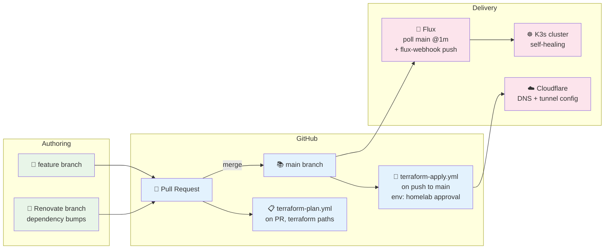
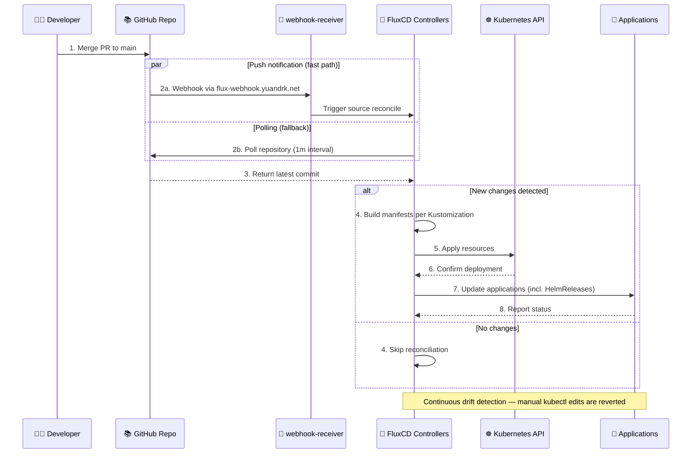
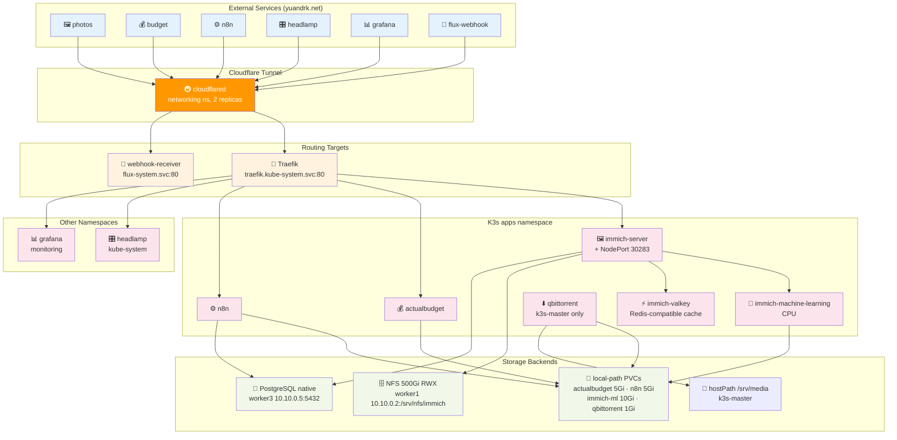
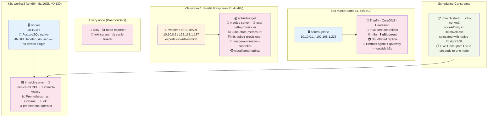

# Infrastructure Architecture Diagrams

This document contains Mermaid diagrams visualizing the homelab infrastructure architecture and workflows.

> Last verified against the live cluster on 2026-06-11 (K3s v1.33.5+k3s1, 3 nodes).
> Deployed app versions drift — check live with `kubectl get deploy -A -o wide` rather than trusting docs.

## Infrastructure Layers Overview

```mermaid
graph TB
    subgraph "External Layer"
        Internet[🌐 Internet]
        CloudFlare[☁️ Cloudflare<br/>DNS + Proxy + Tunnel edge]
    end

    subgraph "Network Layer"
        Router[🏠 BT Router<br/>192.168.1.0/24]
        Switch[🔀 Gigabit Switch<br/>10.10.0.0/24 LAN]
    end

    subgraph "Infrastructure Layer"
        subgraph "AWS"
            S3[🪣 S3 Bucket<br/>terraform-state<br/>native locking]
            OIDC[🔐 GitHub OIDC<br/>CI/CD auth]
        end

        subgraph "Management Tools"
            Terraform[🏗️ Terraform<br/>IaC via GitHub Actions]
            Ansible[⚙️ Ansible<br/>Node config, SSH :2222]
        end
    end

    subgraph "Compute Layer"
        Master[🖥️ k3s-master<br/>amd64, Ubuntu 24.04, 4c/16Gi<br/>10.10.0.1 / 192.168.1.223]
        Worker1[🍓 k3s-worker1<br/>Raspberry Pi arm64, 4c/4Gi<br/>10.10.0.2 / 192.168.1.137<br/>NFS server /srv/nfs/immich]
        Worker3[🖥️ k3s-worker3<br/>amd64, 8c/16Gi<br/>10.10.0.5<br/>PostgreSQL native · MX130 GPU idle]
    end

    subgraph "Container Layer (K3s Cluster)"
        CoreDNS[🌐 CoreDNS]
        Traefik[🔀 Traefik<br/>Ingress controller]
        FluxCD[🔄 FluxCD v2<br/>GitOps controllers]

        subgraph "apps namespace"
            Immich[🖼️ Immich<br/>server + ML + valkey<br/>photos.yuandrk.net]
            ActualBudget[💰 ActualBudget<br/>budget.yuandrk.net]
            N8N[⚙️ n8n<br/>n8n.yuandrk.net]
            QBit[⬇️ qBittorrent<br/>qbit.home.yuandrk.net · tailnet only]
        end

        subgraph "networking namespace"
            Cloudflared[🚇 cloudflared<br/>2 replicas, outbound tunnel]
        end

        subgraph "kube-system namespace"
            Headlamp[🎛️ Headlamp<br/>headlamp.yuandrk.net]
            MetricsServer[📐 metrics-server]
            LocalPathProv[💾 local-path-provisioner]
        end

        subgraph "monitoring namespace"
            Prometheus[📈 Prometheus<br/>10Gi PVC, 15d]
            Grafana[📊 Grafana<br/>grafana.yuandrk.net]
            NodeExporter[📊 Node Exporter<br/>DaemonSet]
            KubeStateMetrics[📊 Kube State Metrics<br/>+ flux-kube-state-metrics]
            Loki[📜 Loki<br/>10Gi PVC + loki-canary]
            Alloy[🚛 Alloy<br/>Log collector DaemonSet]
        end

        subgraph "storage namespace"
            NFSProv[🗄️ NFS Subdir Provisioner<br/>storageclass: nfs-immich]
        end

        subgraph "onepassword namespace"
            OnePassword[🔑 1Password Connect<br/>+ operator]
        end
    end

    subgraph "Data Layer"
        subgraph "Storage"
            LocalPath[💾 local-path<br/>Default StorageClass]
            NFS[🗄️ NFS export on worker1<br/>10.10.0.2:/srv/nfs/immich<br/>Immich 500Gi RWX]
            PostgreSQL[🐘 PostgreSQL<br/>native on worker3<br/>10.10.0.5:5432]
        end

        subgraph "External"
            GitRepo[📚 GitHub<br/>yuandrk/homelabops]
            HelmCharts[📦 Helm Charts<br/>various repos]
        end
    end

    %% External — cloudflared dials OUT to Cloudflare edge
    Internet --> CloudFlare
    Cloudflared -->|outbound tunnel| CloudFlare
    Cloudflared --> Traefik

    %% Network
    Router --> Switch
    Switch --> Master
    Switch --> Worker1
    Switch --> Worker3

    %% Infra
    Terraform --> S3
    Terraform --> OIDC
    Terraform --> CloudFlare
    Ansible --> Master
    Ansible --> Worker1
    Ansible --> Worker3

    %% Orchestration
    FluxCD --> GitRepo
    FluxCD --> HelmCharts

    %% Storage & data
    Immich --> NFS
    Immich --> PostgreSQL
    N8N --> PostgreSQL
    LocalPath --> LocalPathProv
    NFSProv --> NFS

    %% Service exposure
    Traefik --> Immich
    Traefik --> ActualBudget
    Traefik --> N8N
    Traefik --> Grafana
    Traefik --> Headlamp

    classDef external fill:#e1f5fe
    classDef network fill:#f3e5f5
    classDef infra fill:#e8f5e8
    classDef compute fill:#fff3e0
    classDef container fill:#fce4ec
    classDef data fill:#f1f8e9

    class Internet,CloudFlare external
    class Router,Switch network
    class S3,OIDC,Terraform,Ansible infra
    class Master,Worker1,Worker3 compute
    class CoreDNS,Traefik,FluxCD,Immich,ActualBudget,N8N,QBit,Cloudflared,Headlamp,MetricsServer,LocalPathProv,Prometheus,Grafana,NodeExporter,KubeStateMetrics,Loki,Alloy,NFSProv,OnePassword container
    class LocalPath,NFS,PostgreSQL,GitRepo,HelmCharts data
```

## Network Flow Diagram

External traffic never hits the nodes directly: the cloudflared pods open **outbound** connections to Cloudflare's edge, and requests come back down that tunnel to in-cluster Service DNS.

```mermaid
flowchart LR
    subgraph "External Access"
        User[👤 User]
        Domain[🌐 *.yuandrk.net]
    end

    subgraph "Cloudflare"
        CF_DNS[📋 DNS<br/>CNAME → tunnel]
        CF_Proxy[🛡️ Proxy & WAF]
        CF_Edge[🚇 Tunnel edge]
    end

    subgraph "K3s Cluster (10.10.0.0/24 LAN)"
        Cloudflared[🚇 cloudflared ×2<br/>networking ns<br/>pods on master + worker1]
        TraefikSvc[🔀 traefik.kube-system.svc:80]
        WebhookSvc[🔗 webhook-receiver<br/>flux-system.svc:80]
        Ingress[📥 Ingress<br/>Host-based routing]
        Service[🔌 ClusterIP Service]
        Pod[📦 Application Pod]
    end

    %% External flow
    User --> Domain
    Domain --> CF_DNS
    CF_DNS --> CF_Proxy
    CF_Proxy --> CF_Edge
    Cloudflared -.->|outbound connection| CF_Edge
    CF_Edge -->|via tunnel| Cloudflared

    %% Internal routing
    Cloudflared -->|"*.yuandrk.net"| TraefikSvc
    Cloudflared -->|flux-webhook.yuandrk.net| WebhookSvc
    TraefikSvc --> Ingress
    Ingress --> Service
    Service --> Pod

    classDef external fill:#e3f2fd
    classDef cloudflare fill:#ff9800,color:#fff
    classDef k3s fill:#fce4ec

    class User,Domain external
    class CF_DNS,CF_Proxy,CF_Edge cloudflare
    class Cloudflared,TraefikSvc,WebhookSvc,Ingress,Service,Pod k3s
```

Non-tunnel access paths: Traefik listens on node ports 80/443 via svclb (addresses 192.168.1.223 / 192.168.1.137) and on k3s-master's Tailscale address `100.96.117.64`. Hosts under `*.home.yuandrk.net` resolve to that Tailscale address, so they work from any tailnet device and nowhere else. immich-server is additionally exposed on NodePort `30283` for the mobile app.

## GitOps Workflow

Trunk-based: short-lived feature branches and Renovate PRs merge into `main`; there is no `dev` branch. Flux deploys from `main`, Terraform applies from `main` via GitHub Actions.

## FluxCD Reconciliation Flow

Kustomizations: `flux-system`, `apps`, `infrastructure`, `infrastructure-networking`, `monitoring-controllers`, `monitoring-configs`, `secrets`, `storage`.

## Service Architecture

## Node Architecture & Workload Placement

Placement below reflects the live cluster; only the Immich stack is pinned (nodeAffinity to k3s-worker3 in its HelmRelease). Everything else is scheduler-placed and may move — RWO local-path PVCs then pin a pod to wherever its volume was created.

